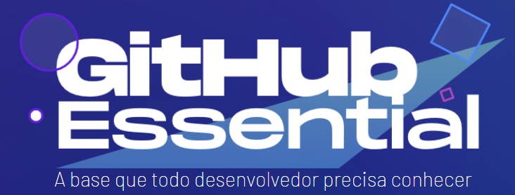

# GitHub Essential

##### 🚧🚧 Esse material está em construção e atualização constante

Quer aprender sobre git e github? Esse é um guia resumido com muitas referências para você não sabe git ou para você que quer se aprofundar! Fique de olho 👀

Você vai aprender a trabalhar com o GIT, como criar e gerenciar seus commits e branches. Depois vamos aprender como deixar tudo disponível no GITHUB e como usá-lo de maneira eficiente, como trabalhar em equipe com code review e como deixar seus repositórios e perfil mais atrativos.

[⏲️ O que é um versionador?](./topics/vcs.md)

[🌱 Conheça o Git](./topics/know-git.md)

- [📗 Entenda o funcionamento](./topics/git-concepts.md)
- [👣 Primeiros passos](./topics/know-git-first-steps.md)
- 🪖 Conceitos e comandos (em breve)
- 🔀 Workflows (em breve)

:octocat: Conheça o GitHub (em breve)

[🚀 Vá + além](./topics/external-refs.md)

---

Quer ficar por dentro das iniciativas de educação e treinamentos da DoubleIT? Nos acompanhe nas redes sociais!

[Linkedin](https://br.linkedin.com/company/doubleit) |
[Instagram](https://www.instagram.com/doubleitconsultoria/?hl=en) |
[Site](https://www.doubleit.com.br/)
