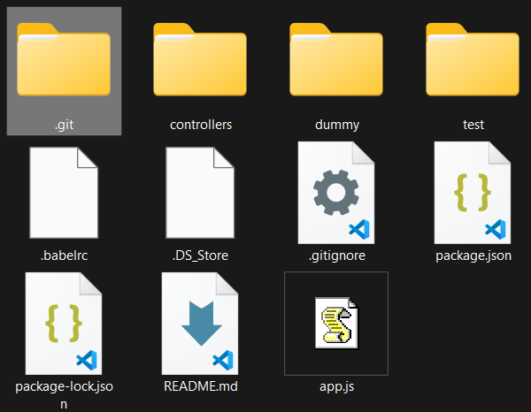

## 1. Repositório

- Armazenamento virtual do projeto
- Cada projeto deve ter seu próprio repo
  - esse é o modelo ideal, é possível manter vários projetos no mesmo repositório usando o modelo monorepo
- Permite registrar e visualizar as versões do código
- Possui uma subpasta `.git`

  - essa pasta mantém os registros do repo localmente

  
  _O projeto git possui uma pasta oculta `.git`, que mantem o histórico._

##### 1.1. Iniciando o Git num projeto

- `git init`[🔗](https://git-scm.com/docs/git-init/pt_BR)
  - inicializa um repositório “zerado” no diretório selecionado
  - usado quando se inicia a pasta não é um repo do git

<br/>

- `git clone`[🔗](https://git-scm.com/docs/git-clone/pt_BR)
  - copia o conteúdo do repositório no diretório e cria as associações com o repositório original
  - usado para trabalhar em projetos já iniciados
  - _veremos o funcionamento nas próximas sessões_

#### 1.2. Status do Git

- `git status`[🔗](https://git-scm.com/docs/git-status/pt_BR)
  - exibe informações sobre o projeto Git

#### 👩‍💻 Mão na massa

```bash
mkdir git-exercise # cria uma pasta com o nome git-exercise
cd git-exercise # faz o ponteiro do terminal entrar na pasta

git status
# verifica as configurações do Git dentro da pasta.
# Nesse caso, deve retornar a mensagem "not a git repository"

git init # inicializa as configs do Git em em repo vazio
```

Com isso, você já tem um repositório configurado localmente para que coloque seus arquivos e pastas.

[⬅️ Conceitos e comandos](./git-commands.md) | [Commit ➡️](./git-commands-02.md)
