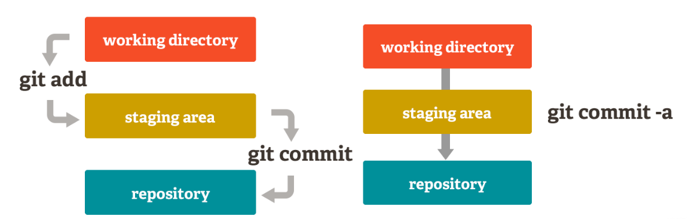

## 2. Commit

- é uma imagem (snapshot) do repositório (mais especificamente de um branch) em um determinado momento
- o conjunto dos commits define o histórico de versões do Git
- é associado a uma hash SHA-1, imutável
  - essa hash é formada por metadados (autor, data, mensagem, etc) e o conteúdo.

### 2.1. Identificando seus commits

- `git config`[🔗](https://git-scm.com/docs/git-config/pt_BR)
  - gerencia configurações globais ou do repo
  - no caso da identificação dos commits, se usa para definir `email` e `name` do usuário local

#### 👨🏾‍💻 Mão na massa

```bash
git config user.name "John Doe" # configura o nome de usuário APENAS no repo
git config user.email "john.doe@email.com" # configura o email do usuário APENAS no repo

# Se quiser configurar apenas uma vez para TODOS os repos
# basta incluir a opção --global
# Ex.: git config --global user.name "New Name"

git config user.name # verifica o nome do usuário no repo
git config user.email # verifica o email do usuário no repo

# Para verificar as informações do usuário configuradas globalmente
# basta incluir a opção --global
```

<br/>

### 2.2. Enviando seus arquivos

Enquanto o `git config` geralmente é executado apenas uma vez no repositório (ou globalmente), os comandos abaixos são executados todas as vezes que é necessário commitar qualquer modificação.

- `git add`[🔗](https://git-scm.com/docs/git-add/pt_BR)
  - inclui os arquivos indicados para a área de STAGING

<br/>

- `git commit`[🔗](https://git-scm.com/docs/git-commit/pt_BR)
  - grava as alterações na base local


_Representação da mudança dos arquivos nas três áreas principais do git._

Nota sobre `git commit -a`: adiciona apenas arquivos que foram alterados e não criados, ou seja, novos arquivos não são enviados para STAGING

#### 👩🏻‍💻 Mão na massa

```bash
echo "# test" >> README.md
# esse comando cria um arquivo, que fica no estado MODIFIED

git add README.md
# adiciona o arquivo README.md em STAGING

git commit -m "first commit"
# efetiva o envio da modificação, gerando e registrando o commit

```

Notas sobre `git add`

- `git add .` - adiciona todas os arquivos modificados
- `git add *.md` - adiciona todos os arquivos com extensão .md
- se eu quiser reverter a adição de arquivos ao STAGING, posso usar o comando `git reset`[🔗](https://git-scm.com/docs/git-reset/pt_BR)

Com isso, você já seu primeiro commit no repostório local.

---

### 2.3. Ignorando arquivos

- Nem todos os arquivos de um projeto devem ser commitados
  - configurações com infos sensíveis, arquivos compilados, etc
- É possível criar um arquivo `.gitignore` para definir o que o git deve ignorar

#### 👩🏽‍💻 Mão na massa

- crie o arquivo [.gitignore](https://git-scm.com/docs/gitignore) na raíz do projeto
- nesse arquivo você pode adicionar o que deseja que o git não inclua nos commits
- coloque uma regra para ignorar todo arquivo .txt
- adicione um arquivo txt e tente fazer um novo commit

Exemplo:

```bash
  /node_modules # igorna toda a pasta
  *.class # ignora a extensão
  doc/**/*.pdf #ignora todos os pdf dentro da pasta doc e sub-pastas
```

Saiba mais:

- [Ignorar arquivos no livro do Pro Git 🌐](https://git-scm.com/book/en/v2/Git-Basics-Recording-Changes-to-the-Repository#_ignoring)
- [GitHub docs - Ignorar arquivos 🌐](https://docs.github.com/pt/get-started/getting-started-with-git/ignoring-files)

---

[🏠 Voltar para o início](./../README.md)

[⬅️ Repositório](./git-commands-01.md) | [Branches ➡️](./git-commands-03.md)
