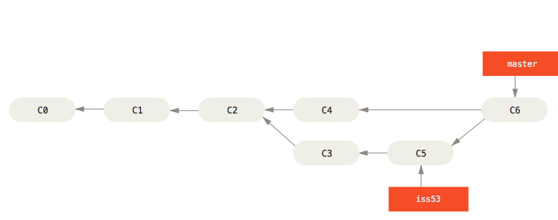
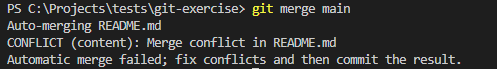
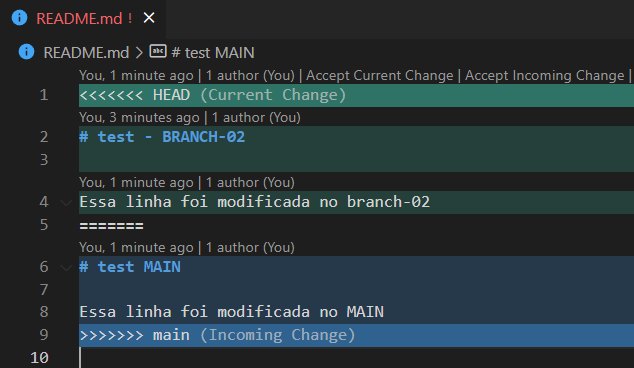

## 5. Merging

- Inclui as alterações commitadas de um branch no branch atual (unifica o registro de históricos)
- O Git tenta resolver todas as modificações automaticamente

"Merging" é um ponto importante ao trabalhar com branches. É altamente recomendado fazer merges constantes com as alterações do branch principal, de forma a evitar conflitos e merges muitos grandes.

<br/>
_Fluxo exibindo o merging do branch iss53 com o master_

Veja mais: [_Pro Git book, escrito por Scott Chacon e Ben Straub_ - item 3.2](https://git-scm.com/book/pt-br/v2/Branches-no-Git-O-b%C3%A1sico-de-Ramifica%C3%A7%C3%A3o-Branch-e-Mesclagem-Merge)

### 5.1. Mesclando alterações de um branch

- `git merge`[🔗](https://git-scm.com/docs/git-merge/pt_BR)
  - une dois ou mais históricos de desenvolvimento
  - o git tenta

#### 👨🏽‍💻 Mão na massa

```bash
# quando estiver num outro branch, execute o comando abaixo
# para mesclar o snapshot de main no branch atual
git merge main

# você pode usar qualquer branch
```

### 5.2. Resolvendo conflitos

- Acontece quando dois devs modificam o mesmo código em branches diferentes
- O Git não sabe o que escolher e marca os arquivos conflitantes
- Pode ser resolvido por terminal, mas é preferível resolver por uma IDE por se tratar de código

<br/>
_Exemplo de mensagem de conflito em um arquivo_

<br/>
_Exemplo de resolução de conflito pelo VS Code_

Leia mais em: [How to Resolve Merge Conflicts in Git – A Practical Guide with Examples 🌐](https://www.freecodecamp.org/news/resolve-merge-conflicts-in-git-a-practical-guide/)

#### 👩🏿‍💻 Mão na massa

```bash
# 1 - crie um branch branch-01
# 2 - faça uma mudança em um arquivo no branch main e faça commit
# 3 - no branch-01, faça outra modificação no mesmo arquivo, na mesma linha

# 4 - faça o merge do main em branch-01
git merge main

# 4 - resolva o conflito no branch-01 e faça um novo commit
# 5 - depois disso é possível fazer um PR ou mesclar o
# branch-01 com o main
```

---

[🏠 Voltar para o início](./../README.md)

[⬅️ Tags](./git-commands-04.md) | [Logs ➡️](./git-commands-06.md)
