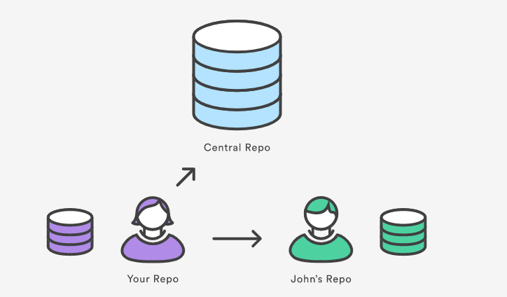

## 7. Remotes

#### ❗Note que até agora, estávamos fazendo tudo localmente

O que fazer se minha cópia local falhar? Ou não tiver mais acesso?
E se meu colega de equipe precisar das minhas alterações?

---

### Remotes

- São “associações” nomeadas com repositório externos
- É possível sincronizar as alterações locais através de comandos
- É possível ter vários remotes no seu repo local
- Esse conceito permite a colaboração entre devs

<br/>
_O repositório pode ter remotes para servidores ou máquinas de outros usuários_

### 7.1. Gerenciando remotes

- `git remote`[🔗](https://git-scm.com/docs/git-remote/pt_BR)
  - gerencia as “associações” com outros repos

#### 👨‍💻 Mão na massa

```bash
# cria a associação com a URL indicada com o nome "origin"
# o nome do remote é um alias, pode ser qualquer string
git remote add origin git@github.com:...
# obs: inclua a url para um repo que você possui acesso

# remove a associação com a url apelidade de origin
git remote rm origin
```

### 7.2. Listando remotes

#### 👨‍💻 Mão na massa

```bash
# lista todos os remotes do meu repositório
git remote

# lista todos os remotes do meu repositório com URL
git remote -v
```

Importante notar que até aqui apenas criamos a conexão do repo local com outro repo (o remote), nada ainda foi sincronizado. É o que veremos nos próximos comandos.

---

[🏠 Voltar para o início](./../README.md)

[⬅️ Logs](./git-commands-06.md) | [Fetch ➡️](./git-commands-08.md)
