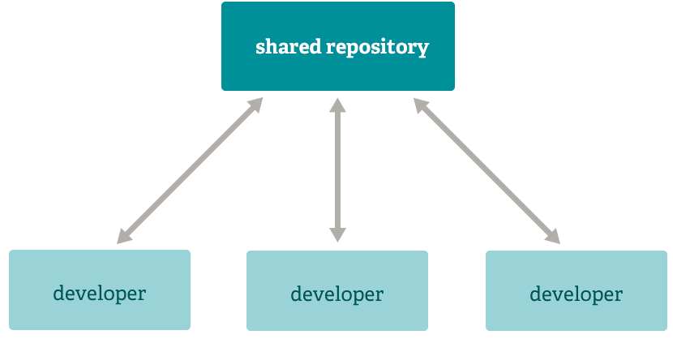
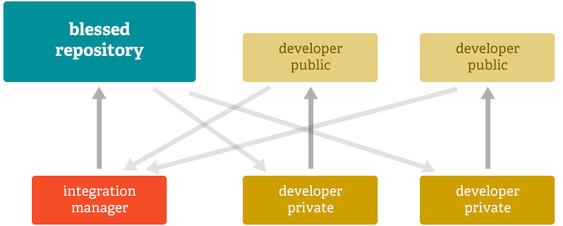
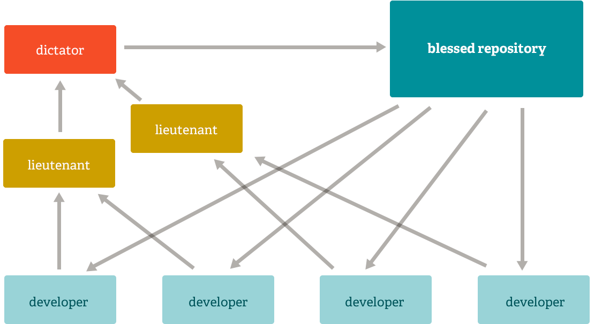
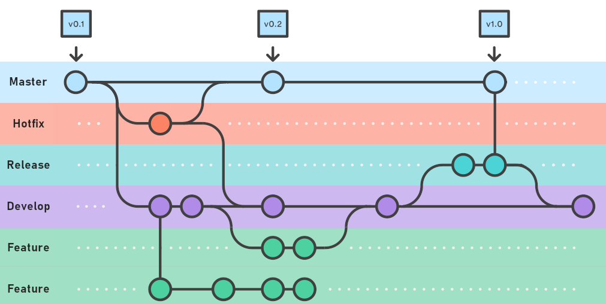

## 🔀 Workflows

São formas de trabalhar e padronizar o uso dos branches dentro de um projeto para proteger e simplificar o “código entregável”

### Características do git que permitem flexibilidade

- 🔛 Distribuído
  - cada usuário possui todo o repo localmente
- 🌳 Ramificações simplificadas
  - é muito fácil criar e gerenciar branches
- 🤝 Contribuições
  - é muito simples criar associações com repositórios (remotes) para sincronizar informações

Em contraste com os “Centralized Version Control Systems” (CVCSs), o git permite que você seja muito mais **flexível na forma dos desenvolvedores contribuírem com os projetos**.

Abaixo seguem alguns modelos de workflow usados com o Git:

#### Centralized Workflow

- simula um CVCS (sistemas centralizados)
- fluxo muito comum na maior parte das equipes
- o Git não permite que você faça um push se não tiver com a última versão sincronizada
- esse fluxo garante que todos só possam fazer alterações depois de sincronizar com o repo central

#### Integration-Manager Workflow

- apenas uma pessoa pode commitar em um repo "abençoado" já que nem tudo pode ir direto para o repo sem passar por verificações
- os devs clonam do repo "abençoado" e sincronizam dali (apenas pull)
- após fazer as mudanças, os devs fazem um pull request (para aprovação do gerente de integração) para incluir no repo "abençoado"
- modelo muito usado em open source

Leia mais em [Pro Git book - Distributed Git - Fluxos de Trabalho Distribuídos 🌐](https://git-scm.com/book/pt-br/v2/Distributed-Git-Fluxos-de-Trabalho-Distribu%C3%ADdos)

#### Dictator and Lieutenants Workflow

- modelo usado em projetos muito grandes, como a kernel do Linux e que envolvem um grande número de devs
- os "generais" ficam responsáveis por aprovar PRs em partes específicas do código
- após aprovação dos "generais", o "ditador" dá a palavra final para aprovar para o repo "abençoado"
- da mesma forma que o modelo "integrarion-manager", os devs podem sincronizar (apenas pull) com o repo abençoado

#### Outros workflows muito usados

##### Git flow

Esse fluxo está mais relacionado à estrutura de branches dentro do repo e não aos relacionamentos entre os repos. Mas é muito usado atualmente, então vale deixar aqui a referência.

- cada branch criado possui um função dentro do fluxo de trabalho do projeto e suas regras para criação e merging.

Entenda melhor em:

- [A successful Git branching model 🌐](https://nvie.com/posts/a-successful-git-branching-model/) - artigo que originou a proposta desse modelo
- [Git Flow: o que é e como gerenciar branches? Exemplos! 🌐](https://blog.betrybe.com/git/git-flow/)

###### Git flow CLI

- Esse CLI abstrai operações básicas de branching no GIT usando o modelo git flow
- É apenas um modelo!
- Apesar de ser muito usado e conhecido hoje no mercado, cada time deve entender sua própria dinâmica de trabalho

Para ver mais:

- [Instale o git flow ⬇️](https://github.com/nvie/gitflow/wiki/Installation)
- [Using git-flow to automate your git branching workflow 🌐](https://github.com/nvie/gitflow)

##### GitHub flow

- é uma simplificação do Git flow
- propõe que exista uma branch principal e as branches de features sejam ramificadas dele
- há muitas críticas com relação a esse modelo pois pode dificultar processos de CI/CD

Entenda melhor em:

- [Fluxo do GitHub 🌐](https://docs.github.com/pt/get-started/quickstart/github-flow)
- [Workflows Comparison: Git Flow Vs GitHub Flow](https://www.freshconsulting.com/insights/blog/git-development-workflows-git-flow-vs-github-flow/)

---

[🏠 Voltar para o início](./../README.md)
