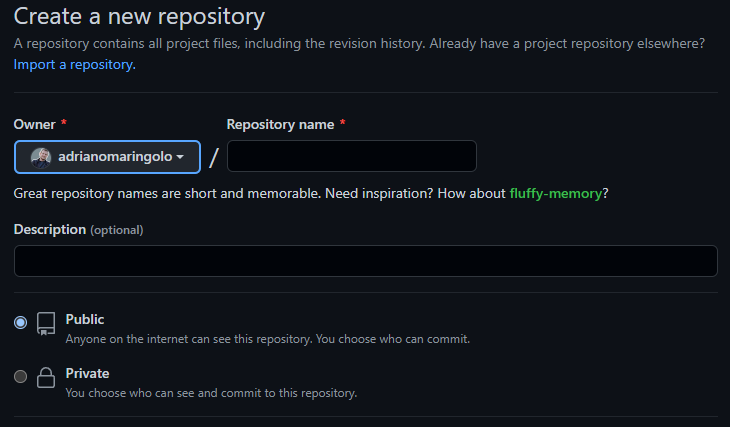
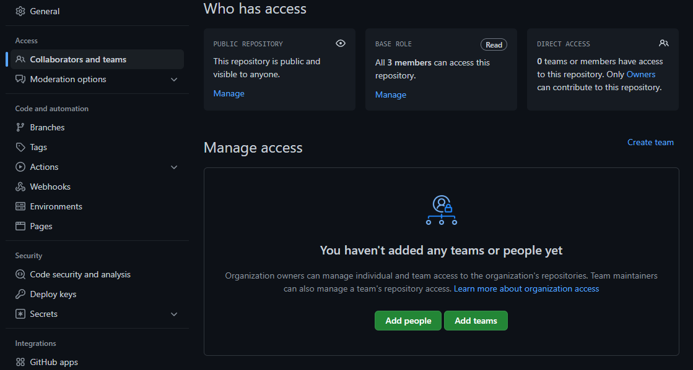
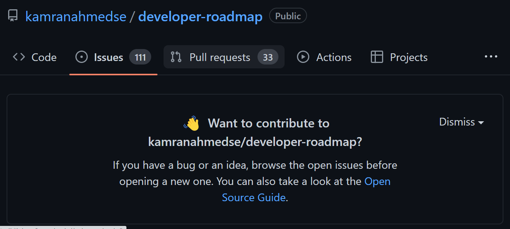
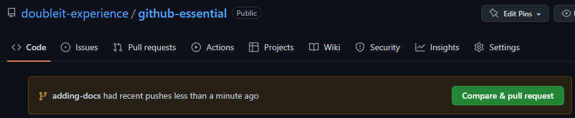
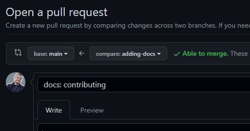
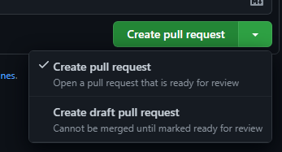
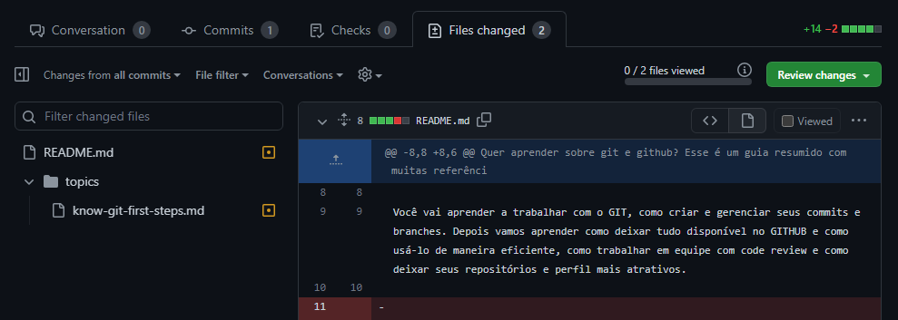
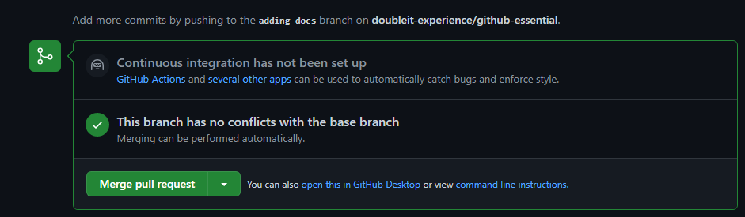

## ⚒️ Funcionalidades

### [1. Criar um repo](https://docs.github.com/pt/get-started/quickstart/create-a-repo)

**Público**
- qualquer pessoa pode ver e fazer forks
- para subir código no repo, precisa ser por PR ou precisa ser colaborador
- open-source

**Privado**
- apenas os colaboradores podem ver e modificar
- proprietário

### [2. Adicionar colaboradores](https://docs.github.com/pt/account-and-profile/setting-up-and-managing-your-personal-account-on-github/managing-access-to-your-personal-repositories/inviting-collaborators-to-a-personal-repository)

### 3. Interagindo com repos

[Watch](https://docs.github.com/pt/account-and-profile/managing-subscriptions-and-notifications-on-github/managing-subscriptions-for-activity-on-github/viewing-your-subscriptions)
- observar repo - mudanças importantes e menções

[Fork](https://docs.github.com/pt/get-started/quickstart/fork-a-repo)
-  criar uma cópia do repo na minha conta

[Star](https://docs.github.com/pt/get-started/exploring-projects-on-github/saving-repositories-with-stars)
- curtir o repositório
- funcionalidade “lists” em beta

[Issues](https://docs.github.com/pt/issues)
- abra bugs, solicitações de mudanças ou dúvidas relacionadas ao repo
- você pode encontrar muitas referências importantes ao navegar pelas issues

### 4. Clonando o repo

[HTTPS](https://docs.github.com/pt/get-started/getting-started-with-git/about-remote-repositories#cloning-with-https-urls)
- o Git solicitará o seu nome de usuário e sua senha do GitHub

[SSH](https://docs.github.com/pt/get-started/getting-started-with-git/about-remote-repositories#cloning-with-ssh-urls) (protocolo seguro)
- você deve gerar um par de chaves SSH no seu computador e adicionar a chave pública à sua conta em GitHub.com
- saiba mais em:
    - [Conectar-se ao GitHub com SSH](https://docs.github.com/pt/authentication/connecting-to-github-with-ssh)
    - [Como funciona a criptografia de chave pública?](https://www.cloudflare.com/pt-br/learning/ssl/how-does-public-key-encryption-work/)

[GitHub CLI](https://docs.github.com/pt/get-started/getting-started-with-git/about-remote-repositories#clonar-com-github-cli)
- abstrai funcionalidades do GitHub
- permanece autenticado

[GitHub Desktop](https://desktop.github.com/)
- interface para gerenciar seus repositórios
- não é preciso usar o git por linhas de comando

Download zip
- é possível apenas baixar os arquivos (sem referências do projeto git) do repositório

### 5. [Pull requests](https://docs.github.com/pt/pull-requests)/[Code review](https://docs.github.com/pt/pull-requests/collaborating-with-pull-requests/reviewing-changes-in-pull-requests/about-pull-request-reviews)
- Ao fazer um merge para o branch principal, pode ser necessário fazer um Pull request (PR) que passe por aprovação
- No PR pode ser ser feito o CODE Review

- Caso haja conflitos, o GitHub vai avisar no momento da abertura do PR

- WIP (Work in progress): é possível abrir Draft PRs e o code review pode ser feito antes do fim do desenvolvimento

- A revisão do código pode ser feita, adicionando comentários, apontando necessidade de mudanças, etc.

- Após a revisão do código, o PR pode ser aprovado e código será reintegrado ao branch indicado
    - é possível criar várias configurações de CI/CD e permissões para garantir a segurança do código

### 6. E muito mais

[Gists](https://docs.github.com/pt/get-started/writing-on-github/editing-and-sharing-content-with-gists): compartilhamento de conteúdos isolados

[Projects](https://docs.github.com/pt/issues/trying-out-the-new-projects-experience/about-projects): ferramenta personalizável e flexível para planejamento e acompanhamento de trabalhos (planilha)

[Project boards](https://docs.github.com/en/issues/organizing-your-work-with-project-boards/managing-project-boards/about-project-boards): criar fluxos de trabalho personalizados adequados às suas necessidades (atralado ao código, PRs, etc)

[Actions](https://docs.github.com/pt/actions): Automatize, personalize e execute seus fluxos de trabalho de desenvolvimento do software diretamente no seu repositório (CI/CD)

[Codespaces](https://docs.github.com/pt/codespaces): IDE online

[Pages](https://docs.github.com/pt/pages): hospedagem de páginas para repos

[Discussions](https://docs.github.com/pt/discussions): fórum de comunicação colaborativo para a comunidade sobre um projeto de código aberto

[Package Registry](https://docs.github.com/pt/packages): publicar e consumir com segurança pacotes

e mais saindo do forno!

---

[🏠 Voltar para o início](./../../README.md)
