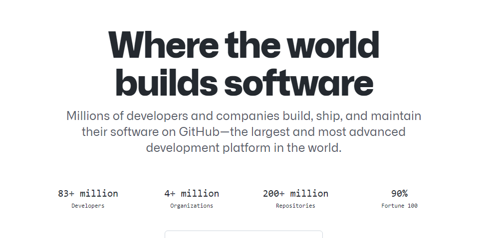
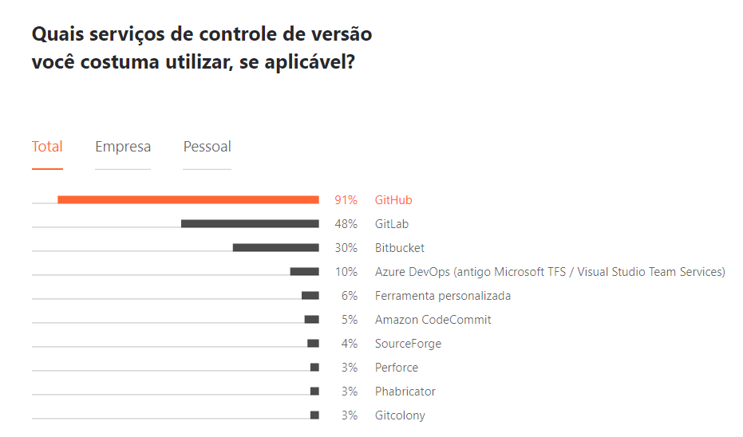

## ⚫ Conheça o GitHub

- Lançado em 2008
- Adquirido pela Microsoft em 2018
- Recursos de colaboração:
  - rastreamento de bugs
  - solicitações de recursos
  - gerenciamento de tarefas
  - integração contínua
  - wikis
  - e muitas outras

Veja mais em [Wikipedia - GitHub](https://en.wikipedia.org/wiki/GitHub)

GitHub em números:

- mais de 83 milhões de desenvolvedores
- mais de 4 milhões de organizações
- mais de 200 milhões de repositórios

---

[🏠 Voltar para o início](./../../README.md)
