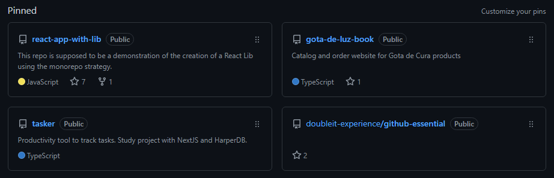
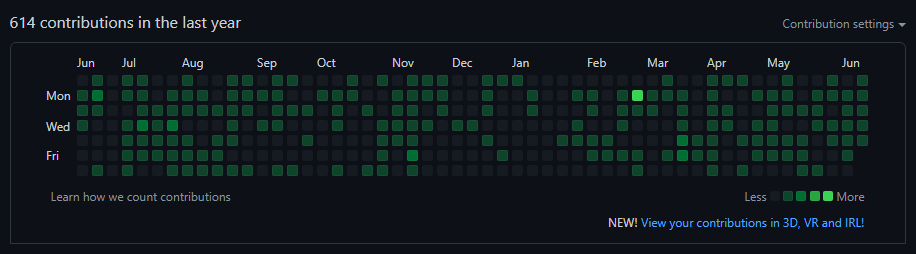

## 👤 Dicas para o perfil

Abaixo seguem algumas dicas para editar seu perfil no GitHub e deixá-lo mais atrativo e informativo para visitantes.

### 1. Preencha suas infos e avatar
- Escreva suas techs principais
- Coloque uma foto legal

### 2. Crie sua página de apresentação

1. crie um repo público com o mesmo nome do seu usuário
2. adicione um arquivo README.md
    - escreva em [markdown](https://www.markdownguide.org/)

3. edite o arquivo com informações sobre você (inclusive tem vários "plugins" pra usar - GitHub Flavored Markdown)

4. commit & push

5. visite seu perfil: github.com/&lt;nome de usuario&gt; e compartilhe!

### 3. “Pin”: destaque seus repos
- Deixe aqueles projetos legais com um destaque no seu perfil

### 4. Crie e contribua
- Crie seus repos e contribua com projetos open-source

---

[🏠 Voltar para o início](./../../README.md)