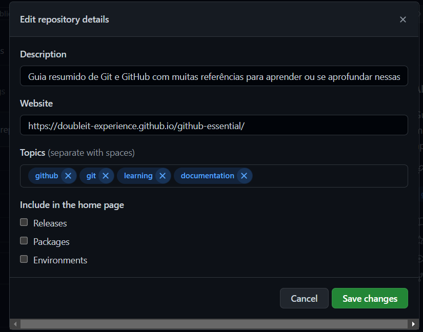
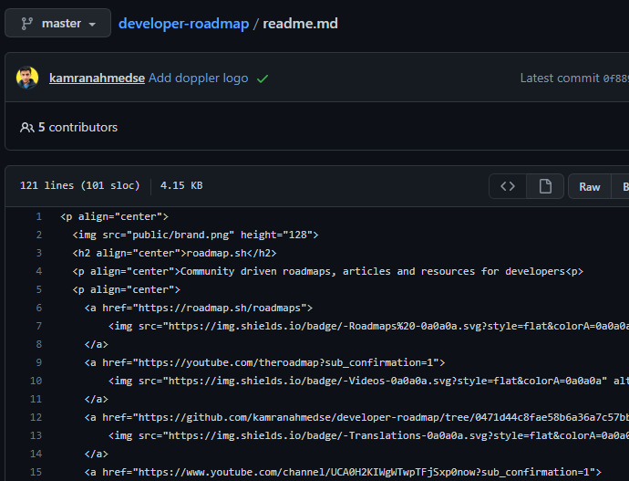
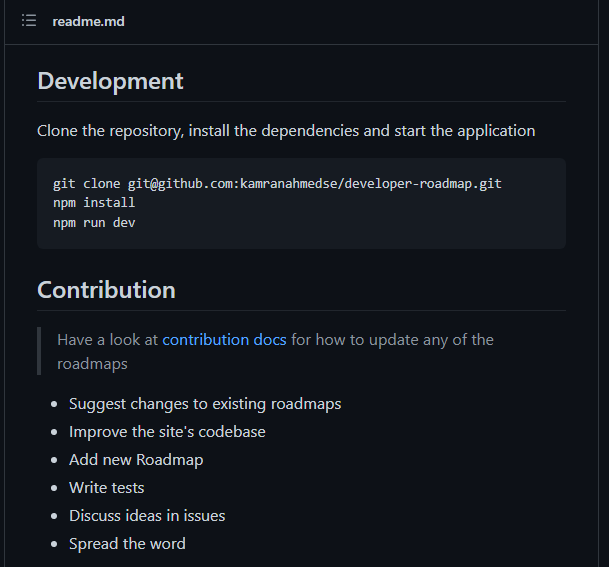

## 🌟 Dicas para o repo

Abaixo seguem algumas dicas gerais para deixar seus repositórios com mais informações detalhadas. Isso vai fazer com que ele seja mais atrativo e informativo para quem o acesssar.

### 1. Defina os detalhes

### 2. Defina o README.md

- O GitHub identifica o README na raiz do projeto como padrão para exibição ao acessar o endereço do repo

### 3. Outras ferramentas
- [🔒 Permissões](https://docs.github.com/pt/repositories/managing-your-repositorys-settings-and-features/managing-repository-settings/managing-teams-and-people-with-access-to-your-repository)
- [🪲 Issues](https://docs.github.com/pt/issues/tracking-your-work-with-issues/quickstart)
- [📚 Wiki](https://docs.github.com/pt/communities/documenting-your-project-with-wikis/about-wikis)
- [🔃 Actions](https://github.com/features/actions)

---

[🏠 Voltar para o início](./../../README.md)