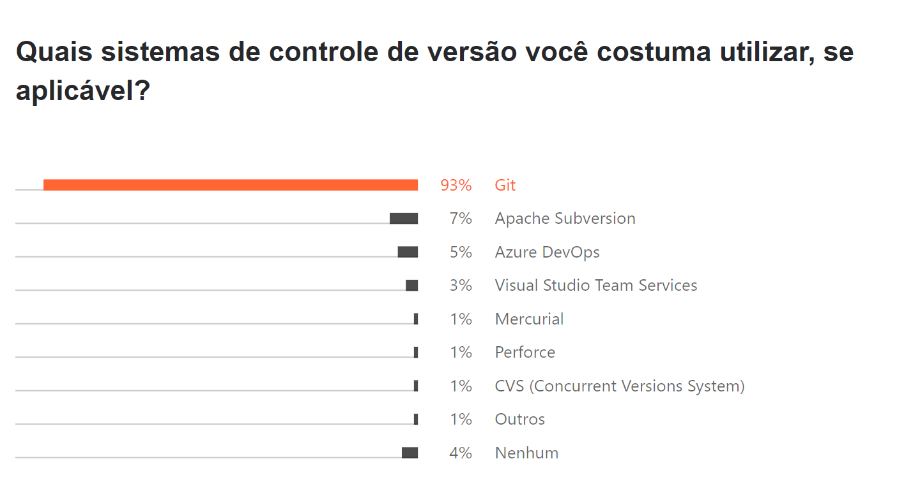
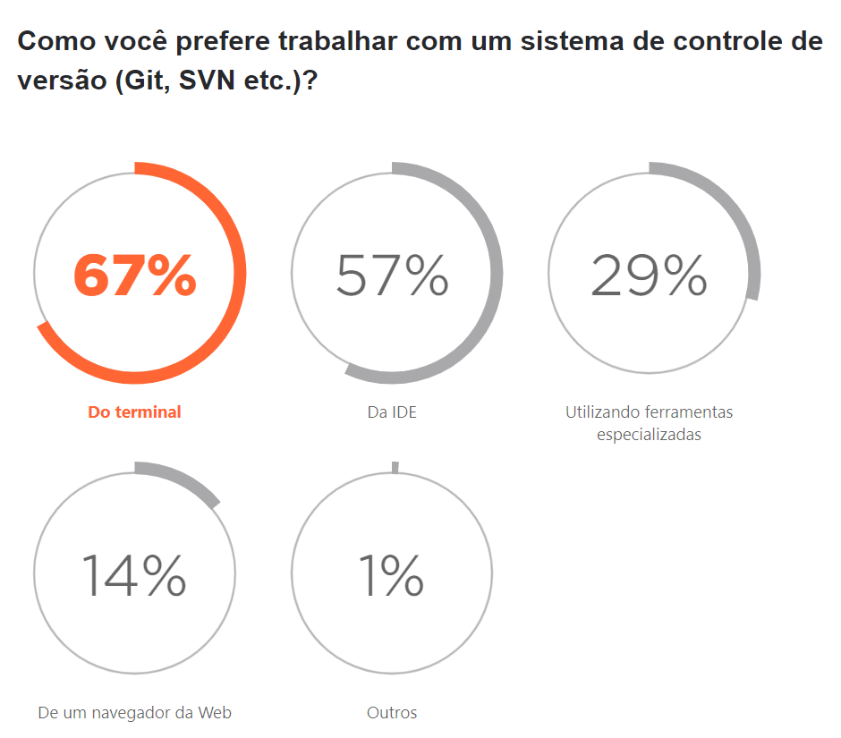

## 🌱 Conheça o Git

- 🐣 Nasceu em 2005 (por Linus Torvalds) - [um pouco da história do git](https://git-scm.com/book/en/v2/Getting-Started-A-Short-History-of-Git)
- 💰 Gratuito e open-source
- 📒 Fácil aprendizado
- 🐇 Performático
- 📈 VCS mais usado
- 🛠️ Integração com serviços e IDEs
- 🖇️ Distribuído:
  - Todos os devs têm o histórico completo do repositório localmente

 
De acordo com a pesquisa anual realizada pela Jetbrains "O Estado do Ecossistema de Desenvolvedores de 2021", <b>93% dos desenvolvedores usam o Git como sistema de controle de versão</b>.

 

 
De acordo com a pesquisa anual realizada pela Jetbrains "O Estado do Ecossistema de Desenvolvedores de 2021", <b>67% dos desenvolvedores preferem trabalhar com um sistema de controle de versão pelo terminal</b>.

---
