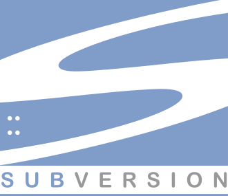

## Subversion

- é centralizada, ou seja, o histórico do repositório fica num servidor
- é simples e de fácil aprendizado

> No meio corporativo, o Subversion é uma ferramenta de controle de versão de software bastante utilizada. Ela é bastante rápida na execução das funcionalidades do sistema e ainda se mostra como uma das mais simples de ser empregada. Isso significa que com um conhecimento básico de conceitos relacionados ao controle de versão de software é possível executar comandos na ferramenta. A aprendizagem da equipe também é rápida nesse aspecto.

> Um dos problemas do Subversion são as críticas relacionadas à eficácia do software. No passado, essa ferramenta apresentou problemas na hora de executar as principais funções de um controle de versão de software eficiente. Porém, as últimas versões lançadas parecem ter solucionado tudo que foi apontado como desvantagem do programa.

> Por fim, o Subversion é uma ferramenta de controle de versão centralizada. Isso significa que não é indicada para todas as equipes de TI, apenas para aquelas que são menores (com apenas algumas dezenas de desenvolvedores) e estão reunidas em um mesmo espaço físico.

Leia mais em: [Conheça 5 ferramentas de controle de versão de software](https://gaea.com.br/conheca-5-ferramentas-de-controle-de-versao-de-software/)

##### Links

- [Apache® Subversion® - site oficial](https://subversion.apache.org/)
- [Apache Subversion - wikipedia](https://en.wikipedia.org/wiki/Apache_Subversion)

---

[⬅️ Voltar](./vcs.md)
