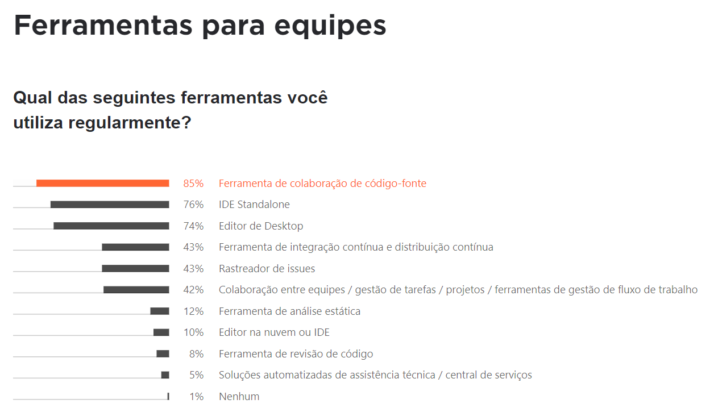

## ⏲️ O que é um versionador?

#### 👉 Pontos a considerar

- Todo dev cria código
- Não posso ter apenas uma cópia do código
- Preciso trabalhar de maneira eficiente em equipe

Essas são algumas das necessidades básicas quando se trabalha com um projeto de contrução de software de qualquer natureza.

#### VSC - Version System Control

- Ferramenta de gerenciamento de código fonte
- Registra o histórico de alterações dos arquivos
- Permite compartilhamento eficiente do código
- Podem ser:
  - distribuídos: múltiplas cópias do código
  - centralizados: apenas uma cópia num servidor

Leia mais em:

- [O que é controle de versão de software e como usar no seu projeto](https://blog.revelo.com.br/controle-versao-software-como-usar/)
- [Why you should move from centralized version control to distributed version control](https://about.gitlab.com/blog/2020/11/19/move-to-distributed-vcs/)

 
De acordo com a pesquisa anual realizada pela Jetbrains "O Estado do Ecossistema de Desenvolvedores de 2021", <b>85% dos desenvolvedores utilizam um versionador frequentemente</b> em suas equipes.

  

#### Vantagens de uso de um versionador

- 🗃️ Rastreabilidade
- 🔒 Segurança
- 🪲 Correção de bugs
- 👥 Integração da equipe

#### Principais versionadores

- [Subversion](./vcs-subversion.md)
- [Mercurial](./vcs-mercurial.md)
- [Git](./know-git.md)

Leia mais em: [Conheça 5 ferramentas de controle de versão de software 🌐](https://gaea.com.br/conheca-5-ferramentas-de-controle-de-versao-de-software/)

#### Por que usar um versionador?

- Reverter alterações que causaram bugs
- Trabalhar em funcionalidades diferentes ao mesmo tempo
- Assegurar um pacote seguro e testado para entregas
- Visualizar alterações realizadas numa linha do tempo e quem a realizou
- Ter o código assegurado num servidor confiável
- Funciona para qualquer código, independente da linguagem

Ou seja, há muitas vantagens em usar um VCS. Todas as equipes precisam usar para assegurar um bom desenvolvimento do projeto.

---

[🏠 Voltar para o início](./../README.md)
